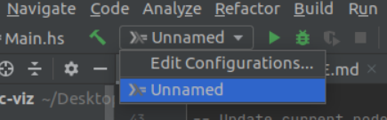

# semantic-viz test

## Project Setup
While their are many different routes to downloading and installing this project and its dependancies, we recomend downloading and installing a local VM: https://www.virtualbox.org/wiki/Downloads, with the Ubuntu operating system: https://ubuntu.com/download/desktop. Tips for installing this environment can be found here: https://brb.nci.nih.gov/seqtools/installUbuntu.html. 

After VM installation is complete: 
  - download the appropriate version of Wordnet: https://wordnet.princeton.edu/download/current-version
  - download and install Haskell: `$ sudo apt-get install haskell-platform`
  - download The Haskell Tool Stack: https://docs.haskellstack.org/en/stable/install_and_upgrade/
  - download the most recent version of Python: https://www.python.org/downloads/source/
  - download MatPlotlib: https://matplotlib.org/users/installing.html
  - download NetworkX: https://networkx.org/documentation/stable/install.html
  - download and install Intellij via Ubuntu Software

**Example**  

After installing the necessary dependancies, make sure to clone the repo `git clone https://github.com/aidanleuck/CS354-Haskell` to an appropriate folder. Then open Intellij and create a new project, with the Haskell Took Stack as the project SDK

Make sure the project location is the cloned repo

After the project has been created, make sure to click on Edit Configurations

Add the Haskell Stack to the configurations. Following, open a terminal in the semantic-viz folder and enter the command `build stack` to build the project and enter `stack exec semantic-viz-exe` to run the project.
